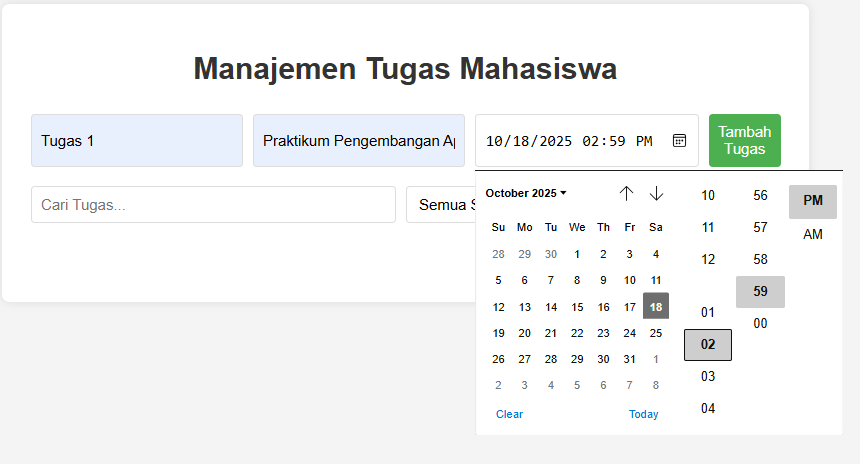

# Aplikasi Manajemen Tugas Mahasiswa

Aplikasi web sederhana untuk membantu mahasiswa mengelola tugas-tugas akademik mereka secara interaktif.

---
## 📷 Screenshot Aplikasi

---

## 🚀 Cara Menjalankan Aplikasi

Untuk menjalankan aplikasi ini, Anda hanya perlu browser web modern (Chrome, Firefox, Edge, dll.).

1.  **Simpan File:** Pastikan Anda memiliki ketiga file berikut di folder yang sama:
    *   `index.html`
    *   `style.css`
    *   `script.js`

2.  **Buka di Browser:** Klik dua kali pada file `index.html` atau seret dan lepas file `index.html` ke jendela browser Anda.

Aplikasi akan segera terbuka dan siap digunakan!

---

## ✨ Daftar Fitur yang Telah Diimplementasikan

Aplikasi ini menyediakan fitur-fitur penting untuk manajemen tugas:

*   **Menambahkan Tugas Baru:** Pengguna dapat menambahkan tugas dengan informasi detail:
    *   **Nama Tugas:** Deskripsi singkat tentang tugas.
    *   **Mata Kuliah:** Mata kuliah terkait tugas tersebut.
    *   **Deadline:** Tanggal dan waktu batas akhir penyelesaian tugas.
*   **Menandai Tugas Selesai/Belum Selesai:** Setiap tugas memiliki tombol untuk mengubah statusnya menjadi selesai atau mengembalikannya menjadi belum selesai. Tugas yang selesai akan memiliki gaya visual yang berbeda (garis coret).
*   **Mengedit Tugas:** Pengguna dapat mengklik tombol 'Edit' untuk mengubah nama tugas, mata kuliah, dan deadline tugas yang sudah ada.
*   **Menghapus Tugas:** Tombol 'Hapus' tersedia untuk menghilangkan tugas yang tidak lagi diperlukan dari daftar.
*   **Filter Tugas:**
    *   **Berdasarkan Status:** Filter untuk menampilkan semua tugas, hanya yang 'Belum Selesai', atau hanya yang 'Selesai'.
    *   **Berdasarkan Mata Kuliah:** Filter tugas berdasarkan mata kuliah spesifik yang dipilih dari daftar mata kuliah yang ada.
*   **Pencarian Tugas:** Kolom pencarian memungkinkan pengguna mencari tugas berdasarkan nama tugas atau mata kuliah.
*   **Tampilan Jumlah Tugas Belum Selesai:** Aplikasi secara otomatis menghitung dan menampilkan jumlah tugas yang belum diselesaikan oleh mahasiswa.

---

## 💻 Penjelasan Teknis

Aplikasi ini dibangun menggunakan teknologi web standar (HTML, CSS, JavaScript) dengan fokus pada interaktivitas dan penyimpanan data lokal.

### 💾 Penggunaan `localStorage` untuk Penyimpanan Data

*   **`localStorage`** adalah API penyimpanan web yang memungkinkan aplikasi JavaScript menyimpan data secara persisten di dalam browser web. Data yang disimpan di `localStorage` tidak memiliki batas waktu kedaluwarsa dan akan tetap ada bahkan setelah browser ditutup dan dibuka kembali, atau komputer dimatikan. Data disimpan dalam bentuk pasangan `key-value` dan hanya mendukung penyimpanan string.

*   **Penggunaan dalam Aplikasi Ini:**
    1.  **Pengambilan Data:** Saat aplikasi pertama kali dimuat (`DOMContentLoaded`), aplikasi mencoba mengambil data tugas yang tersimpan menggunakan `localStorage.getItem('tasks')`. Jika ada, data (yang tersimpan sebagai string JSON) akan diuraikan kembali menjadi objek JavaScript (`JSON.parse()`) dan dimuat ke dalam array `tasks`.
    2.  **Penyimpanan Data:** Setiap kali ada perubahan pada array `tasks` (menambah, mengedit, menghapus, mengubah status), fungsi `saveTasks()` dipanggil. Fungsi ini:
        *   Mengubah array `tasks` menjadi string JSON menggunakan `JSON.stringify()`.
        *   Menyimpan string JSON ini ke `localStorage` dengan kunci `'tasks'` menggunakan `localStorage.setItem('tasks', ...)`

    Dengan cara ini, semua perubahan pada daftar tugas pengguna akan secara otomatis disimpan dan dimuat kembali di sesi browser berikutnya.

### ✅ Validasi Form

Validasi form diimplementasikan untuk memastikan integritas data yang dimasukkan oleh pengguna:

1.  **Validasi Klien-Sisi (Client-Side Validation):**
    *   **`required` attribute:** Pada input HTML (`<input type="text" ... required>`), atribut `required` digunakan untuk memastikan bahwa pengguna tidak meninggalkan kolom nama tugas dan mata kuliah kosong. Browser akan secara otomatis menampilkan pesan peringatan dasar jika kolom ini kosong.
    *   **Validasi JavaScript:** Dalam fungsi `taskForm.addEventListener('submit')` di `script.js`:
        *   **Nama Tugas dan Mata Kuliah Tidak Boleh Kosong:** Aplikasi secara eksplisit memeriksa (`if (!name) { ... }`) apakah input nama tugas dan mata kuliah kosong setelah `trim()` (menghilangkan spasi di awal/akhir). Jika kosong, pesan `alert()` akan ditampilkan, dan proses penambahan tugas dibatalkan.
        *   **Deadline Harus Diisi:** Mirip dengan di atas, aplikasi memeriksa apakah input deadline kosong.
        *   **Deadline Tidak Boleh di Masa Lalu:** Aplikasi membandingkan `new Date(deadline)` dengan `new Date()` saat ini untuk memastikan deadline yang dimasukkan adalah di masa depan. Jika deadline di masa lalu, pesan `alert()` akan ditampilkan.

2.  **Validasi Edit:**
    *   Saat mengedit tugas, `prompt()` digunakan, dan input juga divalidasi secara sederhana untuk memastikan nama tugas dan mata kuliah tidak kosong, serta deadline tidak kosong atau di masa lalu.

Validasi ini penting untuk mencegah pengguna memasukkan data yang tidak lengkap atau tidak valid, sehingga menjaga kualitas data dalam aplikasi.
