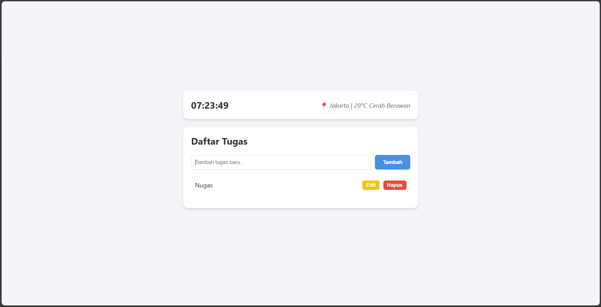

# Personal Dashboard App

Aplikasi Personal Dashboard sederhana berbasis web yang dirancang untuk membantu produktivitas harian. Aplikasi ini memungkinkan pengguna untuk mengelola daftar tugas (To-Do List) serta melihat informasi waktu dan cuaca secara real-time.

Aplikasi ini dibangun menggunakan **HTML**, **CSS**, dan **JavaScript (ES6+)** murni tanpa framework tambahan (Vanilla JS).

## 📷 Screenshot Aplikasi

## 🚀 Fitur Utama

### 1. Manajemen Tugas (To-Do List)
*   **Interaktif (CRUD):** Pengguna dapat **Menambah**, **Mengedit**, dan **Menghapus** tugas dengan mudah.
*   **Penyimpanan Lokal:** Menggunakan `localStorage` browser, sehingga data tugas **tidak hilang** meskipun halaman di-refresh atau browser ditutup.

### 2. Widget Informasi
*   **Jam Digital Real-time:** Menampilkan waktu saat ini (Jam:Menit:Detik) yang diperbarui setiap detik.
*   **Info Cuaca (Simulasi):** Menampilkan data lokasi dan cuaca menggunakan simulasi pemanggilan API asinkron.

## 💡 Implementasi Fitur ES6+

Aplikasi ini memenuhi persyaratan teknis dengan menerapkan standar JavaScript modern (ECMAScript 2015+). Berikut adalah rincian fitur yang digunakan dalam `script.js`:

1.  **Classes (`class`)**
    *   Digunakan untuk membuat `class TaskManager`.
    *   Seluruh logika pengelolaan data (state), penyimpanan (storage), dan rendering dikapsulasi di dalam class ini agar kode lebih terstruktur dan berorientasi objek (OOP).

2.  **Arrow Functions (`=>`)**
    *   Diimplementasikan minimal 3 kali dalam kode:
        *   Pada method array: `this.tasks.filter(task => ...)` saat menghapus data.
        *   Pada method rendering: `this.tasks.forEach(task => ...)` saat me-looping data.
        *   Pada Event Listener: `addBtn.addEventListener('click', () => { ... })`.

3.  **Template Literals (Backticks \` \`)**
    *   Digunakan untuk **String Interpolation** (menyisipkan variabel ke dalam string) tanpa menggunakan operator `+`.
    *   Contoh pada rendering HTML: `` `${task.name}` ``.
    *   Contoh pada format waktu: `` `${hours}:${minutes}:${seconds}` ``.

4.  **Async / Await**
    *   Digunakan pada fungsi `getWeather()`.
    *   Kata kunci `async` mengubah fungsi menjadi asinkron, dan `await` digunakan untuk menunggu proses `Promise` (simulasi delay network 2 detik) selesai sebelum menampilkan data cuaca.

5.  **Let & Const**
    *   **`const`**: Digunakan untuk mendeklarasikan variabel yang nilainya tidak akan diubah kembali (seperti referensi elemen DOM `document.getElementById` atau instance class).
    *   **`let`**: Digunakan jika ada variabel yang nilainya perlu diubah (reassigned) di dalam blok kode tertentu.
    *   Ini menggantikan penggunaan `var` untuk manajemen memori dan scope yang lebih baik.

## 📂 Struktur File

Pastikan ketiga file berikut berada dalam satu folder yang sama agar aplikasi berjalan dengan baik:

*   `index.html` : Struktur utama halaman web.
*   `style.css`  : Pengaturan gaya tampilan (styling) agar antarmuka terlihat rapi dan responsif.
*   `script.js`  : Logika pemrograman utama.

## ▶️ Cara Menjalankan

1.  Pastikan Anda memiliki file `index.html`, `style.css`, dan `script.js`.
2.  Simpan ketiga file tersebut dalam satu folder.
3.  Klik dua kali file `index.html` untuk membukanya di web browser pilihan Anda (Chrome, Firefox, Edge, dll).
4.  Aplikasi siap digunakan!

---
*Dibuat untuk tujuan demonstrasi penggunaan JavaScript Modern (ES6+).*
