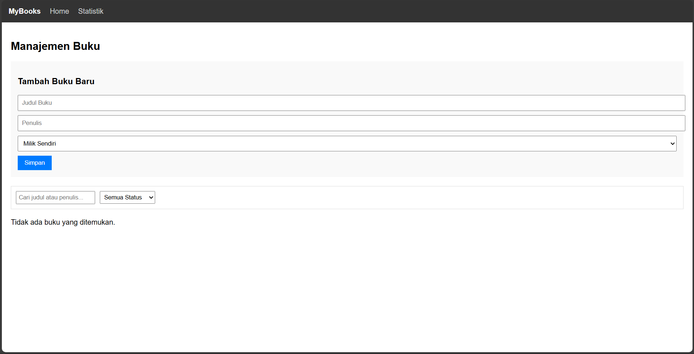
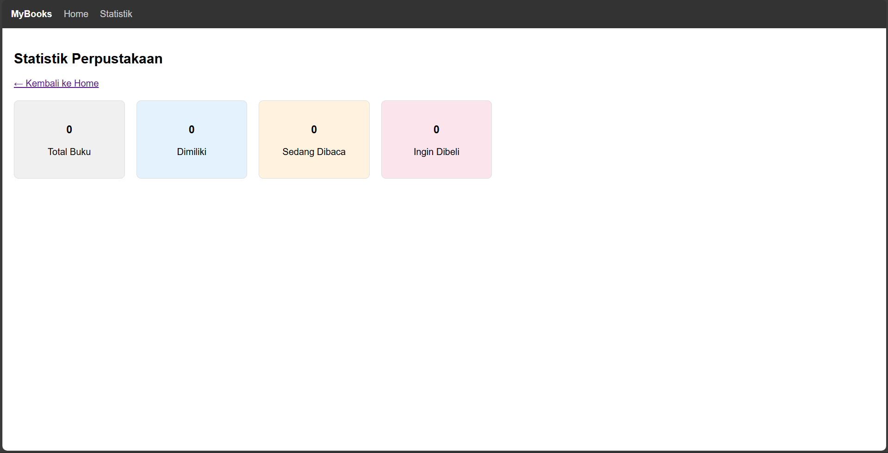
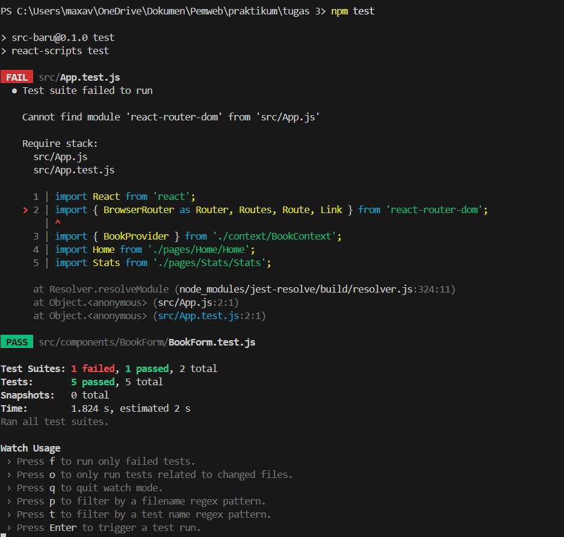

# Aplikasi Manajemen Buku Pribadi 📚

Aplikasi web sederhana berbasis React untuk membantu pengguna mengelola koleksi buku pribadi. Aplikasi ini memungkinkan pengguna untuk mencatat buku yang dimiliki, sedang dibaca, atau yang masih dalam daftar keinginan (wishlist), serta memantau statistik perpustakaan pribadi mereka.

Data buku disimpan secara lokal di browser, sehingga data tidak akan hilang meskipun halaman di-refresh.

## 📷 Screenshot Aplikasi



Gambar di atas merupakan tampilan halaman Home



Gambar di atas merupakan tampilan halaman Statistik



Gambar di atas merupakan hasil test


## 🚀 Fitur Utama

*   **Manajemen Buku (CRUD):** Tambah, Edit, dan Hapus data buku.
*   **Status Buku:** Kategorisasi buku (Milik Sendiri, Sedang Dibaca, Ingin Dibeli).
*   **Pencarian & Filter:** Cari buku berdasarkan judul/penulis dan filter berdasarkan status.
*   **Statistik:** Dashboard visual untuk melihat jumlah total buku dan pembagiannya per kategori.
*   **Penyimpanan Lokal:** Data tersimpan otomatis menggunakan LocalStorage.

## 🛠️ Instruksi Instalasi dan Menjalankan

Pastikan Anda telah menginstal **Node.js** di komputer Anda.

### 1. Persiapan Folder
Buka terminal dan arahkan ke direktori proyek ini.

### 2. Install Dependencies
Jalankan perintah berikut untuk mengunduh semua library yang dibutuhkan (termasuk React dan React Router):

```bash
npm install
```

### 3. Menjalankan Aplikasi
Untuk menjalankan aplikasi dalam mode development:

```bash
npm start
```

Buka http://localhost:3000 di browser Anda untuk melihat aplikasi.

### 4. Menjalankan Test (Opsional)
Untuk menjalankan unit testing yang telah dibuat:

```bash
npm test
```

## ⚛️ Fitur React yang Digunakan

Aplikasi ini dibangun menggunakan konsep Modern React (Functional Components) dengan penerapan fitur-fitur berikut:

### 1. React Hooks
*  `useState`: Digunakan secara luas untuk mengelola state lokal, seperti input form, status filter pencarian, dan toggle modal edit.
*  `useEffect`: Digunakan untuk menangani side-effects, khususnya untuk sinkronisasi data state dengan LocalStorage browser.

### 2. Custom Hooks
Code logic dipisahkan ke dalam custom hooks agar lebih modular dan reusable:
*  `useLocalStorage`: Hook khusus untuk menangani penyimpanan dan pengambilan data dari browser storage secara otomatis.
*  `useBookStats`: Hook yang memisahkan logika perhitungan statistik (menggunakan `useMemo` untuk performa) dari komponen UI.

### 3. Context API (`BookContext`)
Menggunakan Context API untuk **Global State Management**. Ini memungkinkan data buku (`books`) dan fungsi manipulasi data (`addBook`, `updateBook`, `deleteBook`) dapat diakses oleh komponen mana saja (Home, Stats, List) tanpa perlu melakukan *prop drilling* (mengoper props secara berantai).

### 4. React Router
Menggunakan `react-router-dom` untuk membuat aplikasi Single Page Application (SPA) dengan navigasi multi-halaman:
**  /: Halaman utama (Daftar buku dan Form).
**  /stats: Halaman statistik perpustakaan.

### 5. Komponen Modular
Aplikasi dipecah menjadi komponen-komponen kecil yang dapat digunakan kembali (*reusable*):
**  `BookForm`: Menangani input data (baik tambah baru maupun edit).
**  `BookList`: Menampilkan daftar buku (card).
**  `BookFilter`: Menangani logika pencarian dan penyaringan data.

##  📂 Struktur Folder

```Text
src/
├── components/      # Komponen UI Reusable
│   ├── BookForm/
│   ├── BookList/
│   └── BookFilter/
├── context/         # Global State (Context API)
│   └── BookContext.js
├── hooks/           # Custom Hooks logic
│   ├── useBookStats.js
│   └── useLocalStorage.js
├── pages/           # Halaman Utama Aplikasi
│   ├── Home/
│   └── Stats/
└── App.js           # Konfigurasi Routing Utama
```


