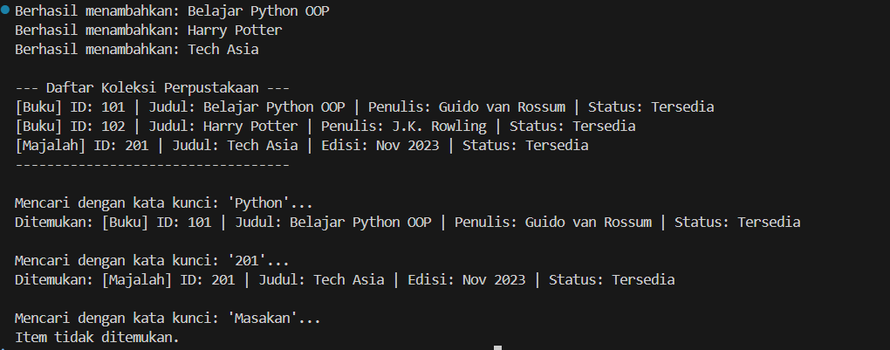
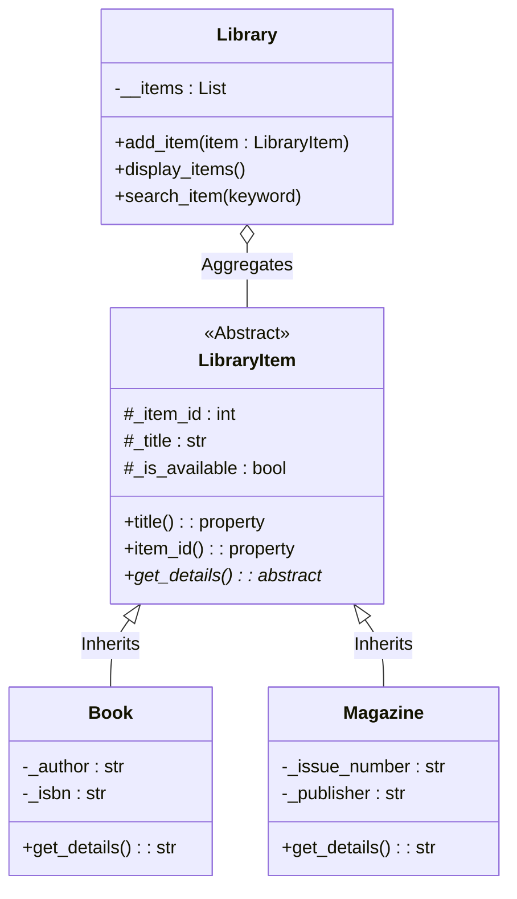

# Sistem Manajemen Perpustakaan Sederhana (OOP Python)

Proyek ini adalah implementasi sederhana dari Sistem Manajemen Perpustakaan menggunakan bahasa pemrograman **Python**. Proyek ini dirancang untuk mendemonstrasikan pemahaman mendalam mengenai konsep Pemrograman Berorientasi Objek (OOP), termasuk **Class**, **Inheritance**, **Encapsulation**, **Polymorphism**, dan **Abstraction**.

## 📷 Screenshot Hasil Running




## 📋 Fitur Utama

Program ini memiliki kemampuan untuk:

1.  **Manajemen Item Beragam (Inheritance & Polymorphism)**
    *   Mendukung penambahan berbagai jenis item perpustakaan seperti **Buku** dan **Majalah**.
    *   Menggunakan *Abstract Base Class* untuk memastikan konsistensi struktur data.

2.  **Keamanan Data (Encapsulation)**
    *   Melindungi data sensitif menggunakan *access modifiers* (`protected` dan `private`).
    *   Mengakses data melalui *Property Decorators* (getter) yang aman.

3.  **Pencarian Cerdas**
    *   Mencari item berdasarkan **Judul** (tidak sensitif huruf besar/kecil).
    *   Mencari item berdasarkan **ID** (mendukung input angka maupun teks).

4.  **Pelaporan**
    *   Menampilkan seluruh daftar koleksi perpustakaan dengan detail yang spesifik untuk setiap jenis item.

## 🏗️ Struktur & Diagram Class

Sistem ini dibangun dengan satu *abstract class* utama yang mewariskan sifatnya ke item spesifik, serta satu class pengelola (`Library`).

### Diagram Class (Mermaid)



###  Penjelasan Hierarki Class

1.  `LibraryItem` **(Abstract Class)**
    *  Class induk yang tidak bisa diinstansiasi langsung.
    *  Menyimpan atribut dasar: ID, Judul, Status Ketersediaan.
    *  Memiliki method abstrak get_details() yang wajib diimplementasikan ulang oleh subclass.

2.  `Book` **(Subclass)**
    *  Mewarisi LibraryItem.
    *  Menambahkan atribut khusus buku: Penulis (author), ISBN.
    *  Mengimplementasikan get_details() khusus format buku.

3.  `Magazine` **(Subclass)**
    *  Mewarisi LibraryItem.
    *  Menambahkan atribut khusus majalah: Edisi (issue_number), Penerbit (publisher).
    *  Mengimplementasikan get_details() khusus format majalah.

4.  `Library` **(Manager Class)**
    *  Bertanggung jawab menyimpan daftar item (__items) secara private.
    *  Menangani logika penambahan, pencarian, dan tampilan data.

##  🚀 Cara Menjalankan

Pastikan Python 3.x sudah terinstall di komputer Anda.

1.  Simpan kode program utama dalam file, misalnya tugas5.py.
2.  Buka terminal atau CMD.
3.  Jalankan perintah berikut:

```Bash
python tugas5.py
```

##  🛠️ Konsep OOP yang Diterapkan

*  **Abstraction:** Menggunakan `ABC` dan `@abstractmethod` pada class `LibraryItem`.
*  **Inheritance:** `Book` dan `Magazine` mewarisi properti dari `LibraryItem`.
*  **Encapsulation:** Penggunaan `_` (protected) pada atribut item, `__` (private) pada list item di Library, dan @property untuk akses data.
*  **Polymorphism:** Method `get_details()` memiliki nama yang sama tapi perilaku berbeda pada Buku dan Majalah, dipanggil secara seragam oleh class `Library`.
